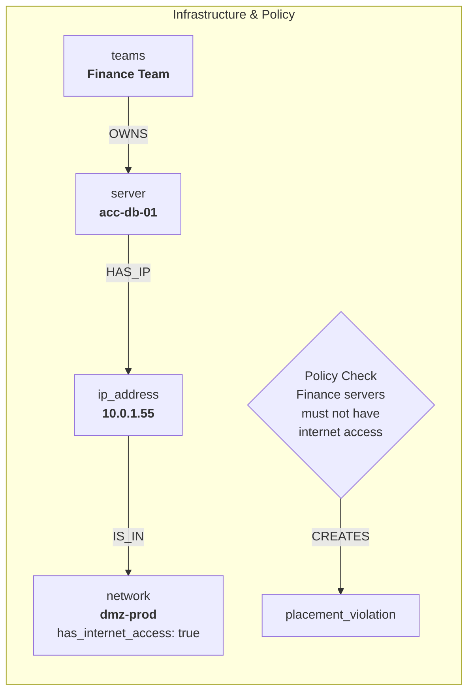

<p align="center">
  <a href="https://rescile.com" target="_blank" rel="noopener">
    
  </a>
</p>

<h1 align="center">rescile: Hybrid Cloud Controller</h1>

<p align="center">
  <strong>From Complexity to Clarity — Build a Living Blueprint of Your Hybrid World.</strong>
  <br><br>
  This repository contains the source for <a href="https://rescile.com">rescile.com</a>, including comprehensive documentation and real-world examples for modeling, governing, and automating your hybrid cloud.
</p>

## What is rescile?

rescile transforms scattered data from your hybrid environment into a single, queryable dependency graph. It creates a "digital twin" of your entire estate, allowing you to go from fragmented data to decisive answers.

With rescile, you can:

- **Generate Complete Deployment Recipes** for Terraform, Ansible, and Kubernetes.
- **Automate Audits** with compliance-as-code for SOX, GDPR, DORA, and more.
- **Achieve True FinOps Cost Attribution** by connecting technical assets to business owners.
- **Proactively Manage Risk** by tracing vulnerabilities from an SBOM to every affected application.
- **Enforce Architectural Standards** and validate your deployed reality against your blueprint.

## 🤝 Contributing

Contributions are welcome! Please feel free to submit a pull request or open an issue for bugs, feature requests, or suggestions.

---

<p align="center">
  Built with ❤️ by the team at <a href="https://rescile.com">rescile.com</a>
</p>

---

## Validating Infrastructure with NetBox as a Source of Truth

Ensuring virtual machines are deployed in the correct networks, on the correct clusters, and adhere to security policies (like no internet access for sensitive systems) is a critical challenge in hybrid environments. When NetBox is your source of truth for network and IPAM data, rescile can ingest this data and use its compliance-as-code engine to automatically validate your infrastructure against defined policies.

### The Model

1.  **Assets**: We export our core infrastructure data from NetBox into CSV files: VMs, IP addresses, networks, and the teams responsible for them.
2.  **Model**: A series of `model/*.toml` files build a connected graph. They create `server` resources from VMs, link them to `ip_address` nodes, and connect those to `network` nodes. This allows critical data, like `has_internet_access`, to be propagated up to the server level.
3.  **Compliance**: A `compliance/*.toml` file defines our placement policies as code. These rules query the graph for specific conditions (e.g., a server owned by the 'Finance' team on an internet-facing network) and create `placement_violation` resources if a policy is broken.
4.  **Verification**: A simple GraphQL query for `placement_violation` nodes instantly reveals all non-compliant servers, providing immediate visibility for remediation.

### The Graph

The importer constructs a graph that models the physical and logical layout of your infrastructure, from the team to the network.



### Complete Example: Detecting Policy Violations

Let's walk through a full example of detecting two common policy violations: a sensitive server with unwanted internet access, and a server running on an unapproved cluster for its OS.

#### 1. Asset Data (`data/assets/`)

We start with CSV exports from our NetBox instance and our team directory.

**`netbox_vms.csv`**
```csv
name,cluster,owner_slug,os_type
acc-db-01,linux-cluster-prod,finance-apps,rhel
web-server-01,linux-cluster-prod,web-dev,ubuntu
win-server-01,linux-cluster-prod,windows-ops,windows
```

**`netbox_ips.csv`**
```csv
name,assigned_to_vm,network_name
10.0.1.55,acc-db-01,dmz-prod
192.168.10.20,web-server-01,internal-prod
10.0.1.56,win-server-01,dmz-prod
```

**`netbox_networks.csv`**
```csv
name,vlan_id,has_internet_access
dmz-prod,101,true
internal-prod,201,false
```

**`teams.csv`**
```csv
slug,name,business_unit
finance-apps,Finance Applications,Finance
web-dev,Web Development,Engineering
windows-ops,Windows Operations,IT
```

#### 2. Architectural Model (`data/models/netbox_infra.toml`)

This model file builds our infrastructure graph in layers, propagating necessary data between the layers. It uses a robust, multi-step process to ensure data is correctly joined and enriched.

```toml
# --- Chunk 1: Create 'server' resources from NetBox VMs ---
origin_resource = "netbox_vms"

[[create_resource]]
resource_type = "server"
relation_type = "_DEFINED_BY"
name = "{{ origin_resource.name }}"
[create_resource.properties]
cluster = "{{ origin_resource.cluster }}"
os_type = "{{ origin_resource.os_type }}"
owner_slug = "{{ origin_resource.owner_slug }}"

# --- Chunk 2: Enrich IP addresses with network information ---
# This step pre-populates all 'netbox_ips' resources with the 'has_internet_access'
# flag from the corresponding 'netbox_networks' resource. This makes the data
# readily available for the next step.
origin_resource = "netbox_ips"

[[link_resources]]
with = "netbox_networks"
on = { local = "network_name", remote = "name" }
copy_properties = [ "has_internet_access" ]

# --- Chunk 3: Enrich 'server' resources with team and final network info ---
origin_resource = "server"

# Link 'server' with 'teams' to copy the business_unit
[[link_resources]]
with = "teams"
on = { local = "owner_slug", remote = "slug" }
copy_properties = [ "business_unit" ]

# Link 'server' to its IP and copy up the pre-enriched network info
# This creates the HAS_IP link and copies `has_internet_access` from the
# `netbox_ips` resource in a single, reliable step.
[[link_resources]]
with = "netbox_ips"
on = { local = "name", remote = "assigned_to_vm" }
create_relation = { type = "HAS_IP" }
copy_properties = [ "has_internet_access" ]
```

#### 3. Compliance as Code (`data/compliance/placement_policy.toml`)

Here we define our corporate placement policies. The compliance engine will find any `server` nodes that violate these rules and automatically create `placement_violation` nodes.

```toml
audit_id = "CORP-PLACEMENT-POLICY-V1"
audit_name = "Corporate VM Placement Policy"

# Rule 1: Finance servers must not have direct internet access.
[[control]]
id = "FIN-SEC-01"
name = "No Internet Access for Finance Systems"

[[control.target]]
origin_resource_type = "server"
match_on = [
  { property = "business_unit", value = "Finance" },
  { property = "has_internet_access", value = true }
]
[control.target.resource]
type = "placement_violation"
name = "violation-internet-{{ origin_resource.name }}"
[control.target.resource.properties]
policy_id = "FIN-SEC-01"
summary = "Finance server has prohibited internet access."
server_name = "{{ origin_resource.name }}"
violating_property = "has_internet_access"
violating_value = "{{ origin_resource.has_internet_access }}"

[control.target.relation]
type = "HAS_VIOLATION"


# Rule 2: Windows servers must be deployed to the dedicated Windows cluster.
[[control]]
id = "WIN-POLICY-04"
name = "Windows Cluster Placement"

[[control.target]]
origin_resource_type = "server"
match_on = [
  { property = "os_type", value = "windows" },
  { property = "cluster", not = "windows-cluster-prod" }
]
[control.target.resource]
type = "placement_violation"
name = "violation-cluster-{{ origin_resource.name }}"
[control.target.resource.properties]
policy_id = "WIN-POLICY-04"
summary = "Windows server is on a non-approved cluster."
server_name = "{{ origin_resource.name }}"
violating_property = "cluster"
violating_value = "{{ origin_resource.cluster }}"

[control.target.relation]
type = "HAS_VIOLATION"
```

#### 4. Verification with GraphQL

After running the importer, we can immediately query for any violations. This single query gives us a complete list of all non-compliant servers across all policies.

```graphql
query FindPlacementViolations {
  placement_violation {
    name
    summary
    policy_id
    server_name
    violating_property
    violating_value
  }
}
```

**Result:**

The query returns the two servers that violate our policies, along with the specific reason for each violation. This structured output can be fed directly into a ticketing or alerting system for automated remediation.

```json
{
  "data": {
    "placement_violation": [
      {
        "name": "violation-internet-acc-db-01",
        "summary": "Finance server has prohibited internet access.",
        "policy_id": "FIN-SEC-01",
        "server_name": "acc-db-01",
        "violating_property": "has_internet_access",
        "violating_value": true
      },
      {
        "name": "violation-cluster-win-server-01",
        "summary": "Windows server is on a non-approved cluster.",
        "policy_id": "WIN-POLICY-04",
        "server_name": "win-server-01",
        "violating_property": "cluster",
        "violating_value": "linux-cluster-prod"
      }
    ]
  }
}
```
